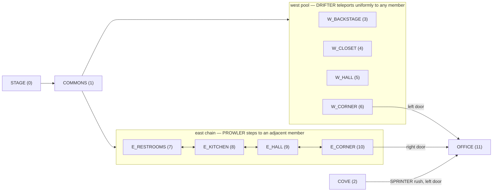

# NightGuard

A partially-observable reinforcement learning environment modelling an asymmetric
surveillance-and-resource-management game: a stationary agent must survive a fixed-length
night against four autonomous adversaries, using a camera system that is simultaneously its
only source of information and one of its costliest actions.

This document is the normative specification. Where it conflicts with any other source,
this document wins. Where it is silent, ask before inventing behaviour.

---

## 0. Read this first

### 0.1 What this project is

A Gymnasium-compatible RL environment plus a trained baseline policy plus a replay viewer.
The mechanics are derived from the documented rule set of a well-known 2014 indie horror
game. Game mechanics and rules are not copyrightable; only their expression is.

### 0.2 Hard constraints on what you generate

These are not stylistic preferences. Violating any of them creates legal exposure.

- **NEVER** use the trademarked franchise name, or any character name from it, anywhere in
  this repository. Not in code, not in comments, not in tests, not in docs, not in commit
  messages, not in variable names.
- **NEVER** download, embed, generate, or reference original game assets: sprites, audio,
  screenshots, room art, UI textures.
- **NEVER** reproduce source code from any existing reimplementation without first checking
  its licence. If the licence is absent or unclear, treat the repository as reference
  documentation only and write original code.
- **DO** use the abstract names defined in section 2 throughout. If you catch yourself
  writing a character name, that is the signal to stop and use the abstract name.
- **DO** keep all numeric constants in configuration files, so that any of them can be
  changed without touching logic.

### 0.3 Prior art you may consult

| Source | Use it for | Licence status |
|---|---|---|
| `CeriW/fnaf1-ai-simulator`, file `research/how-the-game-works.md` | Primary mechanics reference; the power-drain formula in particular was reverse-engineered by playtesting and is more reliable than other published formulas | Licence not advertised. Treat the markdown as factual documentation. Do NOT copy the JS source. |
| `MotoLegacy/OpenFNaF` | Independent cross-check of movement and AI logic | States MIT. Safe to reference; attribute if you borrow. |
| technicalfnaf Fandom wiki, Steam technical guides | Third source for reconciling disagreements | Reference only |
| Gymnasium | Env API, `check_env`, vector env base classes | Dependency |
| `sb3-contrib` | `RecurrentPPO` | Dependency (train extra only) |
| CleanRL | Single-file PPO as a transparent second implementation | Explicitly designed to be copied |
| POPGym | The `Markovian` / `PreviousAction` wrapper pattern and its eval protocol structure | Pattern reference |

---

## 1. Architecture

Four layers, strictly separated. This separation is the single most important structural
decision in the project, because it is what allows the simulator to run headless at high
throughput while the viewer stays completely decoupled.

```
core/     Pure simulation. State, transitions, power, entities.
          MUST NOT import gymnasium, torch, or any rendering library.
          MUST NOT contain any global randomness.
env/      Gymnasium wrapper. Spaces, observation encoding, reward, termination.
          MAY import gymnasium and numpy. MUST NOT import torch.
trace/    Serialisation of ground-truth state to JSONL.
          Consumed by the viewer. Never mutates state.
viewer/   Static HTML/JS. Consumes a trace file. No Python, no server.
train/    PPO configs, curricula, evaluation harness. May import torch.
```

Dependency direction is strictly one-way: `train` → `env` → `core`, and `trace` → `core`.
Nothing depends on `viewer`.

### 1.1 Repository layout

```
nightguard/
├── PROJECT.md
├── README.md
├── pyproject.toml
├── configs/
│   ├── topology/
│   │   └── default.yaml
│   ├── nights/
│   │   ├── night1.yaml … night6.yaml
│   │   └── custom_template.yaml
│   └── presets/
│       └── benchmark_v2.yaml      # v2.0
├── src/nightguard/
│   ├── __init__.py
│   ├── core/
│   │   ├── __init__.py
│   │   ├── config.py          # frozen dataclasses, YAML loaders
│   │   ├── topology.py        # node graph, movement modes
│   │   ├── state.py           # SimState dataclass
│   │   ├── clock.py           # tick/hour arithmetic
│   │   ├── power.py           # drain model
│   │   ├── blackout.py        # three-phase power-out sequence
│   │   ├── rng.py             # seeded Generator plumbing
│   │   ├── sim.py             # NightSim: the transition function
│   │   └── entities/
│   │       ├── __init__.py
│   │       ├── base.py        # Entity protocol + shared opportunity timer
│   │       ├── warden.py
│   │       ├── drifter.py
│   │       ├── prowler.py
│   │       └── sprinter.py
│   ├── env/
│   │   ├── __init__.py
│   │   ├── nightguard_env.py  # gymnasium.Env
│   │   ├── actions.py
│   │   ├── obs.py
│   │   ├── reward.py
│   │   ├── wrappers.py        # Oracle, PreviousAction, AudioMask
│   │   └── vector.py          # numpy-vectorised N-episode runner
│   ├── trace/
│   │   ├── __init__.py
│   │   ├── schema.py
│   │   └── writer.py
│   ├── policies/
│   │   ├── __init__.py
│   │   ├── base.py            # Percept: what a human player can perceive
│   │   └── reference.py       # do_nothing, random, rhythm, monitor_down
│   ├── train/
│   │   ├── ppo.py
│   │   ├── recurrent_ppo.py
│   │   ├── curriculum.py
│   │   └── evaluate.py
│   └── viewer/
│       ├── index.html
│       ├── viewer.js
│       └── viewer.css
├── scripts/
│   ├── run_episode.py
│   ├── validate.py
│   └── export_trace.py
└── tests/
    ├── conftest.py
    ├── test_clock.py
    ├── test_config.py
    ├── test_power.py
    ├── test_topology.py
    ├── test_warden.py
    ├── test_drifter.py
    ├── test_prowler.py
    ├── test_sprinter.py
    ├── test_escalation.py
    ├── test_policies.py
    ├── test_trace.py
    ├── test_blackout.py
    ├── test_determinism.py
    ├── test_no_global_rng.py
    └── test_env_api.py
```

There is no `test_fidelity.py`. The exit-criteria checks live in `scripts/validate.py`, and the
fidelity assertions of §8 are spread across the per-topic test files above, next to the
mechanics they constrain. That layout is deliberate; do not consolidate them.

### 1.2 Stack and conventions

- Python 3.12+. The floor was 3.11 until v0.2; it was raised because numpy's type stubs use
  `type` statements that only parse under 3.12, so `mypy --strict` could not actually be run at
  3.11. An unverifiable support claim is worse than a higher floor.
- Runtime dependencies: `numpy`, `gymnasium`, `pyyaml`. Nothing else in the base install.
- Optional extras: `[train]` adds `torch`, `stable-baselines3`, `sb3-contrib`.
  `[dev]` adds `pytest`, `ruff`, `mypy`.
- Full type annotations. `mypy --strict` must pass on `core/` and `env/`.
- `ruff` for lint and format, default rules plus `I` (isort).
- All configuration objects are frozen dataclasses. No mutable module-level state anywhere.
- **All randomness flows through an injected `numpy.random.Generator`.** Never call
  `random.*`, never call `np.random.*` at module level. `NightSim` takes a `Generator` in
  its constructor. This is tested.
- No magic numbers in logic. Every constant lives in a config dataclass with a default.
- Docstrings on every public function stating units (seconds, ticks, percentage points).

### 1.3 Things you should not do

- Do not put observation encoding, reward, or action decoding in `core/`.
- Do not couple the viewer to a live environment. It reads a file.
- Do not implement the rare-noise adversary (section 3.8) before v2.0.
- Do not add reward shaping terms beyond those in section 6.3 without asking. Shaping terms
  that encode a human strategy defeat the point of the project.
- Do not use `float` equality anywhere in the power model. Use tolerances in tests.

---

## 2. Naming

The abstract names below are the only names used in code. Each entity name describes its
movement mode, so the name doubles as documentation.

### 2.1 Entities

| Name | Movement mode | Approach side | Notes |
|---|---|---|---|
| `WARDEN` | Fixed path, never reverses, camera-suppressed, countdown before each move | East | The hardest to model; see 3.4 |
| `DRIFTER` | Uniform random teleport within a pool of nodes | West | Belief about position decays instantly |
| `PROWLER` | Random step to an adjacent node in a chain | East | Belief decays gradually |
| `SPRINTER` | Advances stage counter in place, then rushes | West | Has no position; has a stage |

### 2.2 Nodes

Twelve nodes. Node IDs are stable integers; never reorder them.

| ID | Constant | Wing | Video feed | Notes |
|---|---|---|---|---|
| 0 | `STAGE` | shared | yes | Start node for WARDEN, DRIFTER, PROWLER |
| 1 | `COMMONS` | shared | yes | Junction; both wings branch from here |
| 2 | `COVE` | west | yes | SPRINTER's home; observing it is not privileged (see 3.5) |
| 3 | `W_BACKSTAGE` | west | yes | |
| 4 | `W_CLOSET` | west | yes | |
| 5 | `W_HALL` | west | yes | |
| 6 | `W_CORNER` | west | yes | Adjacent to office left door |
| 7 | `E_RESTROOMS` | east | yes | |
| 8 | `E_KITCHEN` | east | **no** | Audio-only node; see 3.9 |
| 9 | `E_HALL` | east | yes | |
| 10 | `E_CORNER` | east | yes | Adjacent to office right door |
| 11 | `OFFICE` | — | n/a | Not a selectable camera |

Cameras are the eleven nodes 0–10. `E_KITCHEN` is selectable but returns no visual
observation, only its audio channel.

### 2.3 Node graph

The graph is fully determined by the route definitions in section 3 and by the table above.
This diagram is a reading aid; where it and section 3 disagree, section 3 wins.



`COMMONS` is a member of **both** the west pool and the east chain, so it appears outside
both subgraphs above. `STAGE` is one-way: nothing returns to it.

The three movement regimes overlaid on that graph:

```
DRIFTER   pool  : {COMMONS, W_BACKSTAGE, W_CLOSET, W_HALL, W_CORNER}
                  uniform, any-to-any, adjacency irrelevant
PROWLER   chain : COMMONS <-> E_RESTROOMS <-> E_KITCHEN <-> E_HALL <-> E_CORNER
                  uniform over immediate neighbours, bidirectional
WARDEN    path  : STAGE -> COMMONS -> E_RESTROOMS -> E_KITCHEN -> E_HALL -> E_CORNER -> OFFICE
                  fixed, index-advancing, never reverses (except E_CORNER -> E_HALL on a
                  closed right door)
SPRINTER        : no position at all; a stage counter 0..3 resolved in COVE, then a rush
                  at the left door
```

The asymmetry between the two wings is deliberate and must be preserved. The west wing is a
pool, so observing DRIFTER gives the agent almost no predictive power. The east wing is a
chain, so observing PROWLER gives it a lot. Two different belief-decay profiles in one
environment is most of what makes the memory task non-trivial.

### 2.4 Package and env IDs

- Package: `nightguard`
- Env ID: `NightGuard-v0`
- Additional registered IDs from v2.0: `NightGuard-Easy-v0`, `NightGuard-Hard-v0`,
  `NightGuard-Random-v0`

---

## 3. Simulation specification

This section is normative. Every number here goes into a config file, not into code.

### 3.1 Clock

Three separate clocks. **Conflating any two of them is the most common source of
unexplainable training dynamics. Keep them explicit.**

| Clock | Default | Governs |
|---|---|---|
| Sim tick | `0.1 s` | Power drain, all timers, all entity resolution |
| Movement opportunity | Per-entity, see 3.3 | Independent countdown per entity |
| Agent decision step | `0.5 s` | One `env.step()` call; advances 5 sim ticks |

Night structure:

- The night runs from hour 0 (`12AM`) to hour 6 (`6AM`).
- Hour 0 lasts **90.0 s**. Hours 1 through 5 each last **89.0 s**.
- Total night length: `90 + 5 × 89 = 535.0 s` = **5350 sim ticks** = **1070 decision steps**.
- Reaching `t = 535.0 s` without having been caught is a win, regardless of power state.

Hour boundaries in seconds: `[0, 90, 179, 268, 357, 446, 535]`.

Implement `clock.hour_at(t)` and `clock.hour_boundaries()` and test them against this table
directly. Escalation events (3.3) fire exactly once when a boundary is crossed.

### 3.2 Actions and office state

Office state consists of five booleans plus a camera selection:

```
door_left, door_right      : bool, persistent, toggled
light_left, light_right    : bool, momentary (see below)
monitor_up                 : bool
selected_camera            : int 0..10, meaningful only when monitor_up
```

Lights are **momentary**: a light action sets the light on for exactly one decision step
(5 sim ticks), after which it turns itself off. The original game holds a button; a
momentary model is cleaner in a discrete action space and equivalent for the power model.

Action space is `Discrete(17)`:

| Index | Action | Effect |
|---|---|---|
| 0 | `NOOP` | nothing |
| 1 | `TOGGLE_DOOR_LEFT` | flips `door_left`, unless the door is jammed |
| 2 | `TOGGLE_DOOR_RIGHT` | flips `door_right`, unless the door is jammed |
| 3 | `FLASH_LIGHT_LEFT` | `light_left = True` for this step |
| 4 | `FLASH_LIGHT_RIGHT` | `light_right = True` for this step |
| 5 | `MONITOR_DOWN` | `monitor_up = False` |
| 6–16 | `SELECT_CAM_<n>` for n in 0..10 | `monitor_up = True; selected_camera = n` |

Actions 6–16 fold "raise monitor" and "switch camera" into one, removing a two-step
sequence the agent would otherwise waste capacity learning.

Exactly one action resolves per decision step. Closing both doors therefore takes two
decision steps (1.0 s), and the agent cannot respond to simultaneous threats at both doors
within one step. This is intended. Do not add multi-action steps.

During blackout (3.7) all actions except `NOOP` are no-ops.

### 3.3 The AI level system

Every entity carries an integer `ai_level` in `[0, 20]`.

Each entity has an independent **movement opportunity timer**. When it fires, roll
`r = rng.integers(1, 21)` (uniform over 1..20 inclusive). The opportunity **succeeds** if
`ai_level >= r`. Level 0 can never succeed; level 20 always succeeds; each level is worth
exactly 5 percentage points.

Note the resulting difficulty curve is not monotonic in a naive sense: level 20 is in some
respects *easier* than level 18, because at 20 the agent can predict exactly when the entity
will act, whereas at intermediate levels it can only predict when it probably will. Preserve
this; it is one of the properties that makes the environment interesting.

Opportunity intervals, deliberately mutually non-commensurate so the entities never
synchronise:

| Entity | Interval |
|---|---|
| `WARDEN` | 3.02 s |
| `DRIFTER` | 4.97 s |
| `PROWLER` | 4.98 s |
| `SPRINTER` | 5.01 s |

`WARDEN`'s much shorter interval is why it remains dangerous despite consistently low AI
levels. Do not "fix" this.

**Within-night escalation.** On crossing an hour boundary:

| Hour | Entities gaining +1 level |
|---|---|
| 2AM | `DRIFTER` |
| 3AM | `DRIFTER`, `PROWLER`, `SPRINTER` |
| 4AM | `DRIFTER`, `PROWLER`, `SPRINTER` |

`WARDEN` never escalates within a night. Levels are clamped to 20.

**Starting levels per night preset:**

| Night | WARDEN | DRIFTER | PROWLER | SPRINTER |
|---|---|---|---|---|
| 1 | 0 | 0 | 0 | 0 |
| 2 | 0 | 3 | 1 | 1 |
| 3 | 1 | 0 | 5 | 2 |
| 4 | 1 or 2 (uniform, rolled at reset) | 2 | 4 | 6 |
| 5 | 3 | 5 | 7 | 5 |
| 6 | 4 | 10 | 12 | 16 |

Sanity check to assert in tests: end-of-night levels for night 1 are `0/3/2/2`, and for
night 6 are `4/13/14/18`. If your escalation code produces anything else, it is wrong.

### 3.4 WARDEN

The most intricate entity and the main reason the environment has depth.

**Path.** Strictly deterministic, index-advancing, never reverses:

```
STAGE → COMMONS → E_RESTROOMS → E_KITCHEN → E_HALL → E_CORNER → OFFICE
```

(Community sources disagree on whether `E_HALL` is included. This project includes it.
Record the decision in a config comment and do not revisit it.)

**Stage lock.** WARDEN cannot leave `STAGE` while `DRIFTER` or `PROWLER` is still on
`STAGE`. This means even a maximum-aggression WARDEN configuration is inert early in a
night until the others have escalated enough to move. This is a real mechanic, not a bug.

**Camera suppression.** While `monitor_up` is true, WARDEN automatically fails every
movement opportunity, *regardless of which camera is selected*. Exception at `E_CORNER`,
below.

**The countdown.** A successful opportunity does not move WARDEN immediately. It starts a
countdown of:

```
countdown_seconds = (1000 - 100 × ai_level) / 60
```

| AI level | Countdown |
|---|---|
| 1 | 15.000 s |
| 2 | 13.333 s |
| 3 | 11.667 s |
| 4 | 10.000 s |
| 5 | 8.333 s |
| 6 | 6.667 s |
| 7 | 5.000 s |
| 8 | 3.333 s |
| 9 | 1.667 s |
| ≥10 | 0.000 s |

Raising the monitor **does not pause an in-flight countdown**. The move is taken the instant
the countdown expires; if the monitor is up at that moment the move still lands. Only new
opportunity *rolls* are suppressed by the monitor, not the countdown.

Store the countdown in ticks internally. The `/60` in the formula reflects the original
game's 60 fps frame counter; it exists only to derive the seconds table above and must never
appear as a frame rate anywhere in this codebase.

**Behaviour at `E_CORNER`.** The rules invert:

- Monitor being up no longer suppresses opportunities.
- Looking specifically at camera `E_CORNER` (10) *does* suppress them.
- WARDEN **moves into `OFFICE`** when all of: opportunity succeeds, `monitor_up` is true,
  `selected_camera != E_CORNER`, and `door_right` is open.
- If the opportunity succeeds while `door_right` is closed, WARDEN retreats to `E_HALL`
  (not to `COMMONS`).

Earlier drafts said WARDEN "attacks" here. Read as an immediate kill, that made `OFFICE`
unreachable and the 25%/s office mechanic below dead code. It is a **move**, gated on
`monitor_up` exactly as §3.5's door entities are; the kill happens afterwards, inside the
office, while the monitor is down. CeriW is explicit: WARDEN "cannot enter your office when
your camera is down. He can only enter while you are looking at a camera that isn't
[`E_CORNER`] while the doors are open." Recorded in §10.

The consequence is deliberate and load-bearing: all three path entities can only enter the
office while the monitor is up, so `SPRINTER` is the only entity that punishes keeping the
monitor down. That is the asymmetry §3.5's rationale claims the design has.

**Inside the office.** Once WARDEN reaches `OFFICE`:

- It kills only while `monitor_up` is false, with probability **0.25 per second** (resolved
  per sim tick as `1 - (1 - 0.25)^0.1`, or equivalently roll once per full second of
  monitor-down time; specify one and test it).
- Unlike the door entities, WARDEN does **not** force the monitor down. Holding the monitor
  up indefinitely is a legal, if power-expensive, survival strategy. Do not add a timeout.

### 3.5 DRIFTER

**Movement mode: pool.** On each successful opportunity, DRIFTER teleports to a node chosen
uniformly at random from its pool. The new node need not be adjacent to the current one.

```
pool = {COMMONS, W_BACKSTAGE, W_CLOSET, W_HALL, W_CORNER}
```

`STAGE` is the start node and is one-way: once DRIFTER leaves, it cannot return.

This mode is deliberately chosen for the west wing because it makes observation nearly
worthless for prediction: seeing DRIFTER at `W_CLOSET` tells the agent almost nothing about
where it will be in five seconds. Contrast with PROWLER.

**At the door.** When DRIFTER is at `W_CORNER`, the next successful opportunity resolves:

- If `door_left` is closed → DRIFTER returns to `COMMONS`, regardless of the monitor.
- If `door_left` is open and `monitor_up` is **false** → DRIFTER stays at `W_CORNER` and the
  opportunity is spent. It cannot enter the office unobserved.
- If `door_left` is open and `monitor_up` is **true** → DRIFTER enters `OFFICE`, `door_left`
  becomes **permanently jammed** (its toggle action becomes a no-op for the rest of the
  episode), and the agent is killed the next time `monitor_up` becomes false, or after
  **30.0 s**, whichever is first.

The monitor condition on entry was added in v0.1. Without it this section is self-contradictory
— being killed "the next time `monitor_up` becomes false" presupposes it was true at entry — and
§8.2's night-1 assertion cannot hold, because a `do_nothing` policy leaves both doors open all
night and would be invaded on most seeds. It is also what makes the door entities punish camera
*timing* rather than camera *inattention*, which is the intended asymmetry against SPRINTER.

Note the asymmetry this creates with AI level: at level 20 a closed door *guarantees*
DRIFTER leaves on the next opportunity, whereas at level 15 it may fail repeatedly and camp
outside the door, forcing the agent to burn power. Preserve this.

### 3.6 PROWLER

**Movement mode: adjacency chain.** On each successful opportunity, PROWLER moves to a node
chosen uniformly at random from the neighbours of its current node in this chain:

```
COMMONS ↔ E_RESTROOMS ↔ E_KITCHEN ↔ E_HALL ↔ E_CORNER
```

`STAGE → COMMONS` is one-way. Movement within the chain is bidirectional, so PROWLER can
retreat.

Door resolution at `E_CORNER` is identical to DRIFTER's at `W_CORNER`, using `door_right`
and returning to `COMMONS` when the door is closed.

### 3.7 SPRINTER

SPRINTER has **no position**. It has a stage counter and a set of timers. This is the
entity that punishes camera *usage* rather than camera *inattention*, and it is what makes
the observation cost asymmetric and interesting.

```
stage           : int, 0..3
immune_until    : tick index
bang_count      : int
```

**Camera freeze.** While `monitor_up` is true, SPRINTER automatically fails **all**
opportunities. Note carefully: this is *any* camera, not specifically `COVE`. The common
player belief that you must watch its home camera is wrong, and the environment must model
the true rule.

**Post-camera immunity.** When the monitor is lowered, SPRINTER continues to auto-fail
opportunities for a random duration sampled uniformly from **[0.83 s, 16.67 s]**. Sample
once on each monitor-down transition. (The original resolves this as a per-frame
reactivation roll; a uniform sample over the range is an acceptable and much cheaper
equivalent. One community source gives the range as [0.5, 10.5]; this project uses
[0.83, 16.67].)

**Charging.** Each successful opportunity increments `stage` by 1. On reaching
`stage == 3`, SPRINTER is armed.

**Attack.** Once armed, the attack fires at whichever comes first:

- the next transition of `monitor_up` from false to true, or
- **25.0 s** after arming.

The monitor-raise path gives the agent a very short reaction window before resolution. Model
this as a **0.5 s** grace period (one decision step) during which closing `door_left`
still saves the agent. Put this in config as `sprinter.grace_period_s`.

**Resolution.**

- If `door_left` is open → death.
- If `door_left` is closed → SPRINTER bangs on the door, drains power, resets `stage` to a
  value chosen uniformly from `{0, 1}`, and re-enters its cycle.

**Bang drain.** The first bang costs **1.0** percentage point of power. Each subsequent bang
costs **5.0** more than the previous one: 1.0, 6.0, 11.0, 16.0, and so on. Config as
`sprinter.bang_base_pct = 1.0`, `sprinter.bang_increment_pct = 5.0`.

### 3.8 Rare-noise adversary (out of scope until v2.0)

The original has a fifth entity triggered by a `0.0001%` per-second roll while a specific
camera is selected, which kills unless the agent flicks the monitor. It is trivial to
implement and useless as a v0 mechanic, because at that probability it provides no learnable
signal.

It becomes interesting in v2.0 as an **irreducible-noise ablation**: a rare, unpredictable,
unavoidable death source is a clean test of whether the agent's value function degrades
gracefully under aleatoric risk. Implement it then, behind
`flags.rare_noise_enabled = False`, on node `W_HALL`, with the trigger probability itself
configurable so it can be raised to a level where it actually bites.

### 3.9 Audio channel

The agent cannot see everything, but it is not blind either. The audio channel is what makes
low-camera-usage policies viable, and it is why the agent's camera duty cycle should fall
over training. Four binary signals, emitted for the decision step in which the triggering
event occurred:

| Signal | Fires when |
|---|---|
| `footstep` | DRIFTER or PROWLER completes a move and is at `W_HALL`/`W_CORNER` or `E_HALL`/`E_CORNER` |
| `kitchen` | PROWLER or WARDEN is currently at `E_KITCHEN` |
| `running` | SPRINTER's attack has fired and is in its grace period |
| `bang` | SPRINTER banged on a closed door this step |

`kitchen` is a *state* signal, not an *event* signal: it is the compensation for
`E_KITCHEN` having no video feed. The others are event signals.

### 3.10 Power

Start at **99.0** percentage points.

Let `active` be the count of true values among
`{door_left, door_right, monitor_up, light_left, light_right}`, clamped to `[1, 4]`.
Note the floor of 1: an entirely idle office still drains.

```
night_constant = 0.1 / D
drain_per_second = active / 10 + night_constant     # percentage points per second
drain_per_tick   = drain_per_second × 0.1
```

`D` per night:

| Night | D | night_constant | Idle drain (pp/s) | Max drain (pp/s) |
|---|---|---|---|---|
| 1 | 9.6 | 0.0104167 | 0.1104167 | 0.4104167 |
| 2 | 6.0 | 0.0166667 | 0.1166667 | 0.4166667 |
| 3 | 5.0 | 0.0200000 | 0.1200000 | 0.4200000 |
| 4 | 4.0 | 0.0250000 | 0.1250000 | 0.4250000 |
| 5 | 3.0 | 0.0333333 | 0.1333333 | 0.4333333 |
| 6 | 3.0 | 0.0333333 | 0.1333333 | 0.4333333 |
| custom | 3.0 | 0.0333333 | 0.1333333 | 0.4333333 |

Consequences worth understanding before you implement:

- The floor of 1 means the **first** active control is free: `active` is 1 whether the office
  is idle or has exactly one door shut, one light on, or the monitor up. This is not a bug and
  must not be "fixed"; it is §3.10 as CeriW documents it, and it is why v0.1's exit criterion 3
  needs two doors rather than one.
- The cap of 4 means both doors plus both lights costs the same as both doors plus both
  lights plus the monitor. Camera use is free once you are already spending on four things.
- Holding both doors all night is impossible on every night: at 0.4 pp/s the budget is
  exhausted at t≈241 s, less than halfway.
- Doing nothing all night is always survivable on power alone. This is what makes the
  environment about *when* to spend, not *whether*.

### 3.11 Blackout

Power reaching 0 is **not terminal**. It is a high-hazard absorbing state that the agent can
occasionally survive, and an optimal policy near 5AM should sometimes accept it.

On blackout:

- All doors open. Door jams are irrelevant. All lights off. Monitor forced down and
  unusable. All actions become no-ops.
- All entities except WARDEN are removed from consideration, including any already in the
  office and including an armed SPRINTER.
- WARDEN runs a three-phase sequence:

| Phase | Rule |
|---|---|
| 1. Approach | Every 5.0 s, 20% chance to advance. Guaranteed to advance at 20.0 s. |
| 2. Song | Every 5.0 s, 20% chance to advance. Guaranteed to advance at 20.0 s. |
| 3. Kill | Every 2.0 s, 20% chance to kill. No cap. |

The sequence can take 40+ seconds, so reaching 6AM after a blackout is genuinely possible
and must be reachable in simulation.

**Roll schedule.** Three conventions were left implicit and each of them moves the measured
survival rate materially. All three are settled here and recorded in §10.

1. **The first roll of every phase happens one interval in, not at t=0.** Approach and Song
   first roll 5.0 s after the phase begins; Kill first rolls 2.0 s after it begins. A phase
   therefore always takes at least one full interval, and the 20 s cap is a genuine ceiling
   rather than one of five equiprobable branches. Rolling at t=0 instead moves §8.7 from
   **0.6148 to 0.4389**.
2. **The 20 s guarantee replaces the roll at 20 s, it does not follow one.** Approach and Song
   roll at 5, 10 and 15 s; if all three fail, the phase advances at 20 s with certainty. There
   is no roll at 20 s. The resulting completion mass per phase is exact:

   | Completes at | 5 s | 10 s | 15 s | 20 s |
   |---|---|---|---|---|
   | Probability | 0.200 | 0.160 | 0.128 | 0.512 |

   The 0.512 at 20 s is `0.8³`, the guarantee absorbing all three failures.
3. **A kill roll landing exactly on the survival boundary counts.** If the agent's remaining
   budget is exactly a multiple of the kill interval, the roll at that instant is taken and can
   kill. The strict reading — rolls strictly before the boundary — moves §8.7 from **0.6148 to
   0.6367**, which is 4.5σ at n = 10,000, so a correct implementation would fail §8.7 on
   convention alone and the failure would look like a blackout bug.

**Phase 1 starts from the onset tick**, which is the tick on which §3.13 step 3 detects the
crossing and applies onset. The `blackout` event stamp and the phase anchor both use that tick, so
they agree by construction. **Onset also zeroes power**: the state is "power exhausted", and a
trace depicting a blackout with a quarter of the battery left is internally contradictory.

Forcing a blackout for measurement (§8.7) must therefore zero power and let this rule fire, not
call onset from outside the tick loop — doing the latter stamps the event with an already-written
tick and makes the trace show it one record late.

Reaching `t = 535.0 s` mid-sequence is `SURVIVED`, per §3.1. Blackout is not a separate outcome:
only being killed during it is, and that is `KILLED_BLACKOUT` (§3.12).

### 3.12 Termination

| Cause | Enum value |
|---|---|
| Reached `t = 535.0 s` | `SURVIVED` |
| Killed by an entity | `KILLED_WARDEN`, `KILLED_DRIFTER`, `KILLED_PROWLER`, `KILLED_SPRINTER` |
| Killed during blackout | `KILLED_BLACKOUT` |

Always populate `info["termination_cause"]`. It is the primary diagnostic when a policy
plateaus, and the viewer displays it.

### 3.13 Resolution order within a tick

Fix this order and never change it. Ambiguity here produces bugs that look like fidelity
failures.

1. Apply the agent's action (only on decision-step boundaries).
2. Advance clock; if an hour boundary was crossed, apply AI escalation.
2b. **Resolve monitor edges.** If `monitor_up` changed this tick, fire the raise or lower
   callback. This runs *after* the clock advance so that timers it starts are stamped with the
   tick they occur on. Stamped with the previous tick, SPRINTER's grace period expires exactly
   on the next decision boundary, leaving no step in which to close the door and making §3.7's
   0.5 s reaction window unreachable on the monitor-raise path.
3. Drain power, **unless already in blackout**. If power ≤ 0, clamp it to 0 and enter blackout.
   The drain is skipped once in blackout because power is exhausted; continuing to model it as a
   shrinking negative quantity is meaningless. The clamp is in the same branch that sets the flag,
   because SPRINTER's bang applies a discrete `1 + 5n` cost outside this step and a late one can
   overshoot zero by a wide margin in a single tick. §6.2 encodes `power / 99.0` into a
   `Box(low=0.0)`, so a negative value is either a hard failure or a silent out-of-range input.
4. If in blackout, advance the blackout state machine and check for kill. Return.
5. Decrement WARDEN's countdown; if it expires, execute the move.
6. For each entity in fixed order `[WARDEN, DRIFTER, PROWLER, SPRINTER]`: if its opportunity
   timer fired this tick, roll and resolve.
7. Resolve pending kills (office occupancy timers, SPRINTER grace period expiry).
8. Expire momentary lights at the end of the decision step.
9. Emit trace record.

---

## 4. Configuration schema

All configs are YAML, loaded into frozen dataclasses in `core/config.py`. Every value below
must be overridable.

```yaml
timing:
  sim_tick_s: 0.1
  decision_step_s: 0.5
  hour_durations_s: [90.0, 89.0, 89.0, 89.0, 89.0, 89.0]
  # Entity intervals and WARDEN's countdown are not multiples of the sim tick, so scheduling
  # them in floats accumulates drift. Seconds convert to exact integer units instead:
  #   units = round(seconds × time_units_per_second)
  # 300 = lcm(60, 100) is the coarsest grid on which every timing constant in §3 and §4 is an
  # exact integer — the countdown table divides by 60, the opportunity intervals are
  # two-decimal. At 1/1000 or 1/100 the six non-terminating countdowns fail; at 1/60 all four
  # intervals and both immunity bounds fail. This is a resolution, NOT a frame rate.
  time_units_per_second: 300
  conversion_tolerance: 1.0e-9

topology:
  file: configs/topology/default.yaml

entities:
  warden:
    interval_s: 3.02
    path: [STAGE, COMMONS, E_RESTROOMS, E_KITCHEN, E_HALL, E_CORNER, OFFICE]
    countdown_numerator: 1000
    countdown_per_level: 100
    countdown_divisor: 60
    office_kill_prob_per_s: 0.25
    stage_lock: true
  drifter:
    interval_s: 4.97
    mode: pool
    pool: [COMMONS, W_BACKSTAGE, W_CLOSET, W_HALL, W_CORNER]
    start: STAGE
    corner: W_CORNER      # where door resolution replaces movement
    door: left
    retreat_to: COMMONS
  prowler:
    interval_s: 4.98
    mode: chain
    chain: [COMMONS, E_RESTROOMS, E_KITCHEN, E_HALL, E_CORNER]
    start: STAGE
    corner: E_CORNER
    door: right
    retreat_to: COMMONS
  sprinter:
    interval_s: 5.01
    stages_to_arm: 3
    immunity_range_s: [0.83, 16.67]
    forced_attack_after_s: 25.0
    grace_period_s: 0.5
    bang_base_pct: 1.0
    bang_increment_pct: 5.0
    reset_stage_choices: [0, 1]
    door: left

ai:
  levels: [0, 0, 0, 0]        # WARDEN, DRIFTER, PROWLER, SPRINTER
  level_min: 0
  level_max: 20
  escalation:
    - {hour: 2, entities: [DRIFTER],                       delta: 1}
    - {hour: 3, entities: [DRIFTER, PROWLER, SPRINTER],    delta: 1}
    - {hour: 4, entities: [DRIFTER, PROWLER, SPRINTER],    delta: 1}

power:
  start_pct: 99.0
  active_min: 1
  active_max: 4
  divisor: 10.0
  night_constant_numerator: 0.1   # the 0.1 in night_constant = 0.1 / D, lifted out of logic
  night_divisor: 9.6

office:
  invasion_kill_timeout_s: 30.0
  door_jam_on_invasion: true
  light_momentary: true

blackout:
  # No `enabled` flag. Blackout is unconditional: power reaching 0 always enters the absorbing
  # state. A disable switch would leave the power model — the subsystem everything else is
  # validated against — with an undefined corner where power goes negative and nothing happens.
  approach: {interval_s: 5.0, prob: 0.2, max_s: 20.0}
  song:     {interval_s: 5.0, prob: 0.2, max_s: 20.0}
  kill:     {interval_s: 2.0, prob: 0.2}

flags:
  rare_noise_enabled: false
  timing_jitter_enabled: false
  timing_jitter_pct: 0.0

reward:
  step_survival: 0.01
  reach_dawn: 10.0
  death: -10.0
  power_penalty_coeff: -0.002
  blackout_entry: -0.05
  sparse_mode: false
```

---

## 5. Trace format

Ships in v0.2 and never changes shape afterwards. This is the seam that decouples the viewer
from everything else, and it is also the primary debugging surface during fidelity work.

One JSONL file per episode. A header record, then one record per **sim tick**, then a footer.

**Header:**

```json
{"type": "header", "version": "1.0", "night": 5, "seed": 918442,
 "config_hash": "sha256:...", "topology": [...], "ai_levels_initial": [3,5,7,5],
 "policy": "recurrent_ppo/run_0413/step_2400000"}
```

**Tick record:**

```json
{"type": "tick", "t": 442, "time_s": 44.2, "hour": 0, "power": 38.4,
 "doors": [true, false], "jams": [false, false], "blackout": null,
 "lights": [false, false],
 "monitor": {"up": true, "cam": 5},
 "entities": {
   "warden":   {"node": 8,  "countdown_ticks": 61, "in_office": false},
   "drifter":  {"node": 6,  "at_door": true,  "in_office": false},
   "prowler":  {"node": 10, "at_door": true,  "in_office": false},
   "sprinter": {"stage": 2, "immune_until": 458, "bangs": 1, "armed": false}
 },
 "audio": {"footstep": true, "kitchen": false, "running": false, "bang": false},
 "belief": {"warden": [8, 12], "drifter": [3, 47], "prowler": [8, 47], "sprinter": [2, 0]},
 "action": 5,
 "policy": {"probs": [0.06, 0.01, 0.0, 0.0, 0.11, 0.61, ...], "value": 4.82},
 "metrics": {"belief_error": 2, "cam_duty": 0.34},
 "event": null}
```

- `belief` maps each entity to `[last_observed_node_or_stage, ticks_since_observed]`. This is
  computed by the env, not the core sim, but is written into the trace so the viewer can
  render it without reimplementing the observation logic.
- `policy` is optional and omitted for scripted policies.
- `metrics.belief_error` is the count of entities whose believed node differs from the true
  node. `metrics.cam_duty` is the fraction of the last 100 decision steps with the monitor up.
  Compute both at write time; do not make the viewer derive them.
- `event` is `null` or one of `door_jam_left`, `door_jam_right`, `bang`, `invasion_<entity>`,
  `blackout`, `warden_countdown_start`, `warden_retreat`, `sprinter_armed`, `sprinter_attack`,
  `death_<entity>`, `escalation_hour_<n>`.

  Several events genuinely land on the same tick — an invasion always jams its door on the same
  tick, and a death usually follows the event that caused it — but the field holds a single value.
  Co-occurring events are resolved by a fixed priority (deaths, then blackout, then invasions, then
  attacks, bangs, arming, WARDEN's moves, jams, escalation), so the viewer's scrubber marks the
  most informative one. The complete per-tick list stays in core state for debugging. A consequence
  worth knowing: `door_jam_left` and `door_jam_right` never appear on their own, because a jam is
  always coincident with an invasion and a jammed door is already visible in the office panel.

- `jams` and `blackout` were added in trace version **1.1** (v0.3). §9.1 requires a jammed door to
  read `JAMMED` rather than `open`, and requires the active blackout phase to be visible; version
  1.0 carried neither, and the blackout sequence did not exist when that shape was frozen. This is
  the one permitted extension — recorded in §10 — and v1.2's viewer must not need another. Readers
  should treat a missing key as `null`/`false` so 1.0 traces still load.

- `belief`, `policy` and `metrics.belief_error` are produced by `env/`, which does not exist until
  v1.0. From v0.2 they are emitted as `null` with their keys present, so the shape is stable from
  the first version that ships a trace. `metrics.cam_duty` is pure core state and is emitted.
  `return` in the footer is likewise `null` until reward exists.

**Footer:**

```json
{"type": "footer", "terminated_at": 5350, "cause": "SURVIVED",
 "final_power": 12.4, "return": 20.7, "cam_duty_mean": 0.31}
```

Writing every tick produces ~5350 records per episode. That is fine for inspection traces.
Provide `--stride N` on the writer to subsample to decision steps for long batch runs.

---

## 6. Environment specification

### 6.1 Action space

`gymnasium.spaces.Discrete(17)`, exactly as section 3.2.

### 6.2 Observation space

`gymnasium.spaces.Box(low=0.0, high=1.0, shape=(98,), dtype=np.float32)`.

The design rule: **give the agent exactly what a human player perceives, and nothing more.**
Never leak true entity positions into the observation. That is what the `Oracle` wrapper is
for.

| Block | Dims | Contents |
|---|---|---|
| Resources | 2 | `power / 99.0`, `time_s / 535.0` |
| Office | 5 | `door_left`, `door_right`, `light_left`, `light_right`, `monitor_up` |
| Camera | 12 | one-hot over cameras 0–10, plus a twelfth slot for "monitor down" |
| Belief × 4 | 56 | per entity: 12-dim one-hot of last observed node (all-zero if never observed), 1 normalised `ticks_since_observed`, 1 `visible_now` flag → 14 dims × 4 |
| Audio | 4 | `footstep`, `kitchen`, `running`, `bang` |
| Door proximity | 2 | `left_occupied`, `right_occupied`; non-zero **only** on a step in which the corresponding light was flashed |
| Last action | 17 | one-hot |
| **Total** | **98** | |

For SPRINTER, the 12-dim "node" slot instead encodes its stage as a one-hot over
`{unknown, 0, 1, 2, 3}` in the first five slots, with the rest zero. Document this clearly
in `obs.py`; it is the one irregularity in the layout.

`ticks_since_observed` is normalised as `min(ticks, 600) / 600`. It is important: without it
the agent cannot distinguish "seen one step ago" from "seen a minute ago", and cannot reason
about belief decay at all.

**An entity is "observed" this step if and only if:** the monitor is up and the entity's node
equals the selected camera and that node has a video feed; or the entity is at a door corner
and the corresponding light was flashed this step.

`E_KITCHEN` has no video feed, so selecting it never produces a visual observation. Its
occupancy is conveyed only through the `kitchen` audio signal.

### 6.3 Reward

```
+0.01   per decision step survived
+10.0   on reaching 6AM
-10.0   on any death
-0.002 × (power drained this step − idle drain this step)
-0.05   on entering blackout (once)
```

Approximate maximum return: `1070 × 0.01 + 10 = 20.7`.

The survival term and the power term are already in tension, and that tension *is* the game.
An always-doors-closed policy dies to power depletion; a never-doors-closed policy dies to
entities. The optimum is a peek-then-react loop, and the interesting result is watching the
policy discover it unaided.

**Do not add shaping terms for things like "checked COVE recently".** Those encode a human
strategy and destroy the result.

Provide `reward.sparse_mode: true`, which zeroes the step-survival and power terms and leaves
only the terminal signals. That variant is the actually-hard benchmark and should be reported
alongside the dense one from v2.0.

### 6.4 Wrappers

| Wrapper | Purpose |
|---|---|
| `Oracle` | Appends true node indices for all four entities. Used to measure the partial-observability gap as a number rather than assume it. Non-negotiable; build it in v1.0. |
| `PreviousAction` | Already folded into the base observation, but provide the wrapper form for POPGym-style comparability. |
| `AudioMask` | Zeroes the audio block. Ablation: how much does the environment depend on the audio channel? |
| `FrameStack` | Provided for completeness. Note in its docstring that a stack deep enough to cover a 15 s WARDEN countdown would need 30 frames at 0.5 s, which is why recurrence is the intended approach. |

### 6.5 Vectorisation

The simulation is pure integer and float bookkeeping with no branching that resists
vectorisation. Implement `env/vector.py` as a NumPy-vectorised runner stepping N independent
episodes in lockstep, rather than relying on subprocess vector envs.

Target: **≥ 50,000 decision steps per second per core** at N=256. This puts a full PPO run in
the tens of minutes on a laptop, which is the whole point of the design.

---

## 7. Version roadmap

Three tiers. v0 is a simulator with no RL in it. v1 is an environment with a policy in it.
v2 is a benchmark other people can use.

**Do not begin a version until the previous version's exit criteria pass in CI.**

### v0.1 — Skeleton

Clock, power model, the five office controls, and only `DRIFTER` and `PROWLER`. These two
give you the pool and chain movement modes and exercise door resolution without WARDEN's
countdown or SPRINTER's freeze semantics confusing the picture.

Blackout is a placeholder: power ≤ 0 terminates immediately with `KILLED_BLACKOUT`.
No trace format. No Gymnasium. The deliverable is a `NightSim` you drive with a list of
actions.

**Exit criteria.**
1. `NightSim` accepts a seed and an action script and is fully deterministic.
2. Idle power at 6AM matches the closed form to within `1e-6`:

   ```
   drained = (0.1 + 0.1/D) × 535
   ```

   **The closed form is normative; the table below is rounded display only and is not an
   assertion target.** It is printed to 3 dp and cannot be met at `1e-6`: only nights 3 and 4
   are exact, night 1 is off by 8.3e-5 and nights 2, 5 and 6 by 3.3e-4. Assertions run against
   the closed form.

| Night | Drained (pp) | Remaining (pp) |
|---|---|---|
| 1 | 59.073 | 39.927 |
| 2 | 62.417 | 36.583 |
| 3 | 64.200 | 34.800 |
| 4 | 66.875 | 32.125 |
| 5 | 71.333 | 27.667 |
| 6 | 71.333 | 27.667 |

3. **Two** doors held closed for the entire night on night 1 enter blackout at
   `t ≈ 470.5 s`, inside the 5AM block. (Corrected from "one door" in v0.1. With `active`
   floored at 1 per §3.10, a single control drains at exactly the idle rate and the night never
   blacks out; two give `0.2104167 pp/s` and t = 470.495 s, the figure this criterion already
   quoted. See §10 and `CHANGELOG.md`.)
4. Exactly **three** escalation events fire, at the 2AM, 3AM and 4AM boundaries (ticks 1790,
   2680, 3570). The 1AM and 5AM boundaries carry none — §3.3's table is authoritative, not the
   count of hour boundaries. Assert exactly three events and their tick indices; night-1
   end-of-night levels are `0/3/2/2`.

### v0.2 — Full roster

Add `WARDEN` (camera suppression, countdown, stage lock, inverted rules at `E_CORNER`,
25%/s office kill) and `SPRINTER` (stage counter, universal camera freeze, immunity window,
door bang, forced attack), the trace format from §5, and office entry for `WARDEN`.

Door jam and office invasion for `DRIFTER` and `PROWLER` shipped in v0.1; `WARDEN` does not
jam a door (§3.4 gives it no jam mechanic) and its office kill is probabilistic rather than
monitor-triggered.

From this version on, every episode can emit a trace.

**Exit criteria.**
1. All four entities can produce a kill in simulation, verified by seeded tests.
2. Same seed plus same action script produces a **byte-identical** trace file. This is
   tested, not assumed.
3. `WARDEN`'s countdown is not paused by monitor raises, verified by a targeted test.
4. `SPRINTER` cannot advance while the monitor is up, and cannot advance during the
   immunity window after it comes down.
5. `WARDEN` cannot leave `STAGE` while either door entity is on `STAGE`.

### v0.3 — Fidelity lock

The full three-phase blackout, then the validation suite. **This is the critical path
milestone.** Everything before it is straightforward implementation; everything after it
depends on the simulator being correct.

Also ship a minimal trace viewer here, because visual debugging beats reading JSONL when
chasing a fidelity bug.

**Exit criteria.** All of section 8 passes.

### v1.0 — Environment

Gymnasium wrapper over a simulator you already trust. Spaces, observation encoding, reward,
`reset(seed)`, `step`, `info` carrying full ground truth. `Oracle` and `PreviousAction`
wrappers. Vectorised runner.

**Exit criteria.**
1. `gymnasium.utils.env_checker.check_env` passes with no warnings.
2. 10,000 random-policy episodes across all six nights complete without exception.
3. Observation vector never contains a true entity position, verified by a test that
   perturbs a hidden entity and asserts the observation is unchanged.
4. A 100,000-step rollout using the v1.1 policy architecture completes in under 60 seconds of
   environment time on one core, measured with observation encoding active. **Record the figure and
   the hardware.**

   This replaces "≥ 50,000 decision steps/s/core at N=256". That number was never derived from
   anything, and §6.5's own feasibility argument states the actual requirement: throughput that
   "puts a full PPO run in the tens of minutes on a laptop". Two machines running identical code
   measured 73,726 and 13,031 decision steps/s — a 5.7× spread — so the original criterion passes on
   one and fails on the other. A gate that swings on the host is measuring the host, and would fail
   unpredictably on CI or a colleague's laptop while looking like a regression. The environment is a
   single-digit percentage of v1.1's wall clock at either figure. Revisit in v1.1 with the training
   loop as the benchmark; if profiling shows the environment is genuinely the bottleneck, vectorise
   then, against a measured need and with an object-versus-vectorised equivalence test as a hard
   gate.
5. `reset(seed=k)` twice produces identical trajectories under a fixed action sequence.

### v1.1 — Baseline policy

`RecurrentPPO` with an LSTM. Frame stacking is not viable given the 15 s countdown.

Curriculum starts at **night 3**, not night 1. Night 1 is close to degenerate: with levels
rising only to `0/3/2/2`, a do-nothing policy survives it most of the time. Use night 1 as a
sanity check that the environment does not kill spuriously, not as a training stage.

**Exit criteria.**
1. Learning curve is monotonically improving over 2M steps on night 4.
2. Trained policy beats `do_nothing` survival rate on nights 4 and 5 by a clear margin.
3. The `Oracle` versus partial-observability gap is measurable and non-zero. If it is zero,
   the observation space is leaking and you must find the leak before proceeding.
4. Camera duty cycle measurably decreases over training, indicating the agent has learned to
   lean on the audio channel.

### v1.2 — Policy visualiser

See section 9.

**Exit criteria.** Load a 5350-record trace, scrub to any tick, step forward and back, and
correctly explain a death by inspecting the value trace and belief error in the ~30 steps
preceding it.

### v2.0 — Benchmark

Randomised AI configurations sampled across the `21^4` space with a difficulty-stratified
sampler. Held-out configuration set for a generalization split. Optional timing jitter.
Rare-noise flag from 3.8.

**Exit criteria.** Published baseline table: mean survival rate over N=1000 episodes on
held-out configs, for `random`, `do_nothing`, `rhythm`, `PPO`, `RecurrentPPO`, each with and
without `Oracle`, and each in dense and sparse reward mode.

### v2.1 — Release

Packaging, docs, `pip install nightguard`, registered env IDs, reproducibility instructions.

**Exit criterion.** A third party reproduces the v2.0 table from a clean checkout.

---

## 8. Validation suite

Lives in `scripts/validate.py` and, for the per-mechanic assertions, in the per-topic test
files listed in §1.1. This is where most of the real effort in v0 sits, and it is the step
people skip and regret.

### 8.0 Non-vacuity

Every statistical assertion must be accompanied by a check demonstrating the test can fail.

- Determinism tests must first assert that the action script produces at least N distinct
  outcomes across seeds, then assert reproducibility within a seed. An all-`NOOP` script is
  vacuous: with the §3.5 and §3.4 monitor gates, no entity can enter the office, so every seed
  produces an identical surviving episode on every night.
- Threshold assertions must record the measured value alongside the threshold, so a test
  passing by a factor of ten is visible rather than silently green.
- Any assertion that is structurally unable to fail at the current milestone must be marked
  `provisional` in the test file, with a note stating which milestone restores its meaning.
- This applies to human verification steps as well as automated assertions. A manual check requires
  a fixture capable of exercising it, and that fixture must be named alongside the check rather than
  assumed. **A verification step that cannot fail reports nothing.**

### 8.1 Passive power curves

Assert the v0.1 exit table for all six nights, to `1e-6`.

### 8.2 Reference policy survival rates

Two reference policies ship permanently and act as the regression suite:

- `do_nothing`: always `NOOP`.
- `rhythm`: hand-coded loop. Roughly: flash alternating lights, close the corresponding door
  if occupied, drop the monitor, raise it briefly on a fixed cadence to freeze SPRINTER.
  Tune it once by hand and then freeze it.

Over 10,000 seeded episodes:

- **Night 1:** measured `do_nothing` survival must agree with the analytic derivation from
  §3.3 and §3.7 within binomial sampling error. The derived value is **0.2397**; see
  `CHANGELOG.md` for the derivation. This replaces the original "must be ≥ 0.8" threshold,
  which was unreachable against a faithful SPRINTER. An agreement test is strictly stronger
  than a threshold because it can fail in both directions, which is what makes this the most
  diagnostic assertion in the suite.
- **Nights 2 to 6:** survival must be non-increasing, permitting ties, and bounded above by a
  small constant. Record the measured values per §8.0.
- `rhythm` must beat `do_nothing` on nights 3 through 6.

Near-zero `do_nothing` survival from night 2 onward is expected and correct. Under the §3.4
and §3.5 monitor gates, `WARDEN`, `DRIFTER` and `PROWLER` cannot enter the office against a
policy that never raises the monitor, so `SPRINTER` is the sole kill path for `do_nothing`.
Its expected success count is 8.95 on night 2 and 14.0 on night 3 against an arming threshold
of 3, so survival is indistinguishable from zero and the original strict monotonic chain
(`night 3 < night 2 < night 1`) cannot be satisfied at any sample size. Do not restore it, and
do not adjust the night-1 figure after measuring — if the measurement disagrees with the
derivation, one of them is wrong and that is the finding.

### 8.3 WARDEN stage-to-office latency

For AI levels 1 through 10, with all other entities disabled and the stage lock bypassed,
measure mean time from leaving `STAGE` to arriving at `E_CORNER`. Assert it is monotonically
decreasing in AI level, and that it agrees with the analytic prediction in `CHANGELOG.md`.
Monotonicity alone is weak; agreement with the derived curve is the real test.

**The countdown is quantised upward.** Countdowns are exact on the 1/300 s grid, but a tick is
30 units and `units_to_ticks` is ceiling division, so AI 2's 13.333 s countdown expires at
13.4 s. Per-level countdown deltas are therefore an alternating 16 and 17 ticks, never a uniform
16.67. That is correct and unavoidable; it is recorded here so it does not read as a bug.

| AI | 1 | 2 | 3 | 4 | 5 | 6 | 7 | 8 | 9 | 10 |
|---|---|---|---|---|---|---|---|---|---|---|
| ticks | 150 | 134 | 117 | 100 | 84 | 67 | 50 | 34 | 17 | 0 |
| delta | — | 16 | 17 | 17 | 16 | 17 | 17 | 16 | 17 | 17 |

**Measure on an extended night.** At AI 1 the predicted walk is ~335 s of a 535 s night and a
material fraction of episodes do not reach `E_CORNER` before dawn, so the sample mean is censored
and biased downward for reasons unrelated to fidelity. Lengthen `timing.hour_durations_s` for this
measurement so every level completes. §8.3 is already a synthetic configuration — entities
disabled, stage lock bypassed — and an uncensored mean is what the derivation predicts.

### 8.4 SPRINTER attack frequency versus camera duty

Run a family of scripted policies that raise the monitor for 0.5 s every `k` seconds and
measure SPRINTER attacks per night. Two assertions:

- **A hard zero.** For `k ≤ 1.4 s` SPRINTER records zero attacks on every seed, because the
  unfrozen window cannot open at all. This is deterministic rather than statistical and is the
  sharpest available test of the immunity mechanic: a single attack means either the freeze or
  the immunity window is wrong.
- **Agreement with the derived curve.** Measured attacks per night track the unfrozen fraction
  derived in `CHANGELOG.md`, not merely increase monotonically.

Two constraints on the family, both of which the original wording got wrong:

- **`k` must be a whole number of decision steps.** Actions resolve once per 0.5 s step (§3.2),
  so `k ∈ {0.75, 1.25}` cannot be expressed by any policy. The family is
  `{0.5, 1.0}` for the hard zero and `{1.5, 2, 4, 6, 8, 10, 15, 20, ∞}` for the curve.
- **The bound is 1.4 s, not 1.33 s.** The continuous bound is `0.5 + 0.83 = 1.33 s`, but the
  immunity window is sampled in grid units and `units_to_ticks` ceilings 249 units to 9 ticks, so
  the realised minimum is 0.9 s and the hard-zero region is `k ≤ 0.5 + 0.9 = 1.4 s`.

The original assertion — "approximately flat for `k` below the lower bound of the immunity
window" — was untestable with its own family: the flat region is `k ≤ 1.4 s` and
`{2, 4, 6, 8, 10, 15, 20, ∞}` has no point below it. Between `k = 2` and `k = 4` the unfrozen
fraction rises by a factor of eight, which is the opposite of flat.

### 8.5 Determinism

Run 100 episodes with random seeds and random action scripts. Re-run with the same seeds and
scripts. Assert trace files are byte-identical.

### 8.6 Escalation

Assert end-of-night levels for all six nights, including night 6's `4/13/14/18`.

### 8.7 Blackout survivability

With power forced to 0 at `t = 500 s`, leaving a 35 s blackout budget, assert the measured
survival rate to 6AM agrees with the analytic value derived in `CHANGELOG.md` within binomial
sampling error over 10,000 seeded runs.

The original wording — "strictly between 0 and 1" — is nearly vacuous: it passes for anything
except a completely broken sequence. The derived value is sharp, and the assertion is sensitive
in both directions:

| Blackout budget | P(survive) |
|---|---|
| 20 s | 0.9501 |
| 25 s | 0.8977 |
| 30 s | 0.7736 |
| **35 s** | **0.6148** |
| 40 s | 0.4707 |
| 45 s | 0.2833 |

---

## 9. Replay viewer

A **static** HTML file that consumes a JSONL trace. No Python, no server, no build step.
Vanilla JS, inline SVG, no framework, no CDN dependency. Drop the trace next to the HTML and
it plays.

This constraint is deliberate: the same viewer must serve v0.3 fidelity debugging and v1.2
policy analysis with zero changes, and must be shareable as two files.

### 9.1 Layout

Target width 680–900 px. Four horizontal bands: header, map, panels, transport.

```
+--------------------------------------------------------------------------+
| Night 5     03:41     step 442 / 1070            Power [####------] 38%   |
+--------------------------------------------------------------------------+
|                                                                          |
|                     +-------------+     +--------------+                 |
|                     | west pool   |     | west corner  |----+            |
|                     |  (D)   [D]  |---->|              |    |            |
|   +-----------+---->+-------------+     +--------------+    |            |
|   |  stage /  |                                             v            |
|   |  commons  |     +-------------+                   +----------+       |
|   +-----------+     | cove  2/3   |------------------>|  office  |       |
|                     |    (S)      |                   +----------+       |
|                     +-------------+                         ^            |
|                     +-------------+     +--------------+    |            |
|                     | east chain  |     | east corner  |----+            |
|                     | (W)   [P]   |---->|     (P)      |                 |
|                     +-------------+     +--------------+                 |
|                                                                          |
|          (X) = ground truth   [X] = agent's last observation             |
+------------------+------------------+------------------------------------+
| Office           | Action pi(a|s)   | Diagnostics                        |
| Left door  CLOSED| lower monitor .61| V(s)            4.82               |
| Right door   open| cam COVE      .22| Belief error     2 / 4             |
| Lights        off| flash R light .11| Cam duty         0.34              |
| Monitor  up W_HALL| no-op        .06| Seed           918442              |
+------------------+------------------+------------------------------------+
| [>] [<] [>]  |-------------O------------------------------|      442     |
+--------------------------------------------------------------------------+
```

The wireframe collapses each wing into one box for space. **The real map renders all twelve
nodes**, with the west pool as a 2x2 cluster of individual nodes and the east chain as a row
of four, so that a token's exact node is always readable.

Lane geometry, left to right:

| Column | Contents |
|---|---|
| 1 | `STAGE` and `COMMONS`, stacked. The shared origin. |
| 2 | West pool cluster (top), `COVE` (middle), east chain row (bottom) |
| 3 | `W_CORNER` (top), `E_CORNER` (bottom) |
| 4 | `OFFICE` |

`COVE` occupies the middle lane and connects to `OFFICE` by a single straight horizontal
edge that passes between the two corner nodes without crossing either. That routing is
deliberate: it visually encodes the fact that SPRINTER bypasses the map entirely.

Panel contents:

- **Header:** night label, in-game clock derived from `time_s`, step counter `n / 1070`,
  power bar. Colour the power bar by remaining fraction.
- **Map:** twelve nodes, entity tokens as labelled circles, colour-coded by wing. Highlight
  the currently selected camera's node with a distinct border.
- **Office panel:** explicit discrete readouts for `door_left`, `door_right`, lights,
  monitor up/down and selected camera **by node name, not index**. Stated outright, never
  inferred from the map. A jammed door reads `JAMMED`, not `open`.
- **Policy panel:** top four actions by probability with bars. Hidden entirely if the trace
  has no `policy` block.
- **Diagnostics panel:** `V(s)`, belief error `k / 4`, camera duty cycle, seed.
- **Transport:** play/pause, step back, step forward, timeline scrubber, current tick.

### 9.2 The belief overlay

This is the headline feature and the reason the viewer is worth building rather than just
recording video.

For each entity, render two tokens: a **solid** token at its true node, and a **dashed
ghost** at the node where the agent last observed it. When those diverge and the agent does
not check, you are watching it gamble. When they converge just before a door closes, you are
watching it work. This is the single view that makes a POMDP policy legible.

Requires the trace to carry ground truth even though the agent never sees it. That is by
design; the trace is a debugging artifact, not an observation.

### 9.3 Diagnosis workflow

The viewer must support this specific workflow, because it is the main thing it is for:
scrub back thirty steps from a death and determine whether

- the value function had already collapsed, meaning the agent knew it was dead and the real
  mistake happened earlier, or
- the value dropped off a cliff, meaning the agent was blindsided, which usually indicates a
  gap in the observation space rather than a policy failure.

Render `V(s)` as a sparkline over the last 100 steps so this is visible at a glance.

### 9.3.1 Verification fixtures

Per §8.0, a manual check needs a fixture capable of exercising it. These two are confirmed to
contain what they claim, and together they cover the viewer's checklist:

```bash
# ~1130 records. jams (False,False) -> (False,True), PROWLER walking 0,1,7,8,9,10 into the OFFICE,
# DRIFTER 0,1,6, invasion_prowler and death_prowler, footstep and kitchen audio, KILLED_PROWLER.
python scripts/export_trace.py --night 5 --seed 0 --policy random --out trace.jsonl

# ~950 records. WARDEN's full path 0,1,7,8,9,10, SPRINTER stages 0->3, warden_countdown_start and
# warden_retreat, a natural blackout through all three phases, death_blackout.
python scripts/export_trace.py --night 6 --seed 7 --policy rhythm --stride 5 --out trace.jsonl
```

A roster-disabled forced-blackout trace is **not** a viewer fixture: every entity token sits on
`STAGE` for the whole episode, no entity event fires, and `jams` is `(False, False)` in every
record, so the `JAMMED` versus `open` distinction the check demands is unreachable rather than
merely unverified. Keep that trace as §8.7's isolated fixture only.

### 9.4 Also required

- Event markers on the scrubber for every non-null `event` field.
- Keyboard control: space to play/pause, arrow keys to step, shift-arrow for ten steps.
- Handle traces without a `policy` block gracefully, hiding the policy panel.
- Handle a `--stride`-subsampled trace without breaking the timeline.

---

## 10. Locked decisions

These were debated and settled. Do not revisit them without asking. Record each in a config
comment at its point of use.

| Decision | Resolution | Why |
|---|---|---|
| Frame rate ambiguity in sources (30 vs 60 fps) | Everything is in seconds internally. The `/60` appears once, in deriving the countdown table. | The ambiguity must not enter the codebase. |
| Does WARDEN's path include `E_HALL`? | Yes. | CeriW's reference is the most carefully derived source. |
| Door jam on failed close | In from v0.2. | It is the reason camera timing matters. Without it the door is a free action. |
| Lights held or momentary | Momentary, one decision step. | Cleaner action space, equivalent power model. |
| Rare-noise adversary in v0 | No. Returns in v2.0 as an ablation. | No learnable signal at 0.0001%/s. |
| Blackout terminal? | No. Survivable absorbing state. | Optimal play near 5AM should sometimes accept it. |
| Decision step length | 0.5 s | 1070 steps/episode, long enough to be a memory task, short enough to train. |
| Curriculum start | Night 3 | Night 1 is near-degenerate. |
| SPRINTER immunity range | `[0.83, 16.67]` s | Two sources disagree; CeriW is better evidenced. |
| WARDEN office kill rate | 0.25 / s | Two sources disagree (0.20 vs 0.25); CeriW is better evidenced. |
| Does one active control drain more than none? | No. `active = clamp(count, 1, 4)`, §3.10 as written. | Two sources disagree: CeriW gives count-with-floor-1, the Steam drainage guide's measured 12/20/29/38 pp per hour imply `1 + count`. CeriW is better evidenced, and §3 is normative. §7's v0.1 criterion 3 was corrected to match. |
| Can a door entity enter the office with the monitor down? | No. Entry requires `monitor_up`. | §3.5's kill trigger presupposes it, and it is what makes the door entities punish camera timing. CeriW confirms it directly. |
| Is WARDEN's `E_CORNER` "attack" a kill or a move? | A move into `OFFICE`, gated on `monitor_up`. The kill is the 25%/s roll afterwards, while the monitor is down. | Read as a kill, `OFFICE` is unreachable and the 25%/s mechanic is dead code. CeriW: WARDEN "cannot enter your office when your camera is down." |
| Timing grid resolution | `time_units_per_second: 300` = `lcm(60, 100)`. | The countdown table divides by 60; the opportunity intervals are two-decimal. 300 is the coarsest grid on which both are exact. Not a frame rate: the `/60` becomes an integer multiply, which strengthens the frame-rate lock above rather than weakening it. |
| §8.2's night-1 `do_nothing` threshold | Replaced by agreement with the analytic derivation (0.2397). | The original ≥ 0.8 is unreachable against a faithful SPRINTER, and an agreement test can fail in both directions. |
| Does a success restart an in-flight WARDEN countdown? | No. It is ignored. | §3.4 is silent. WARDEN is already committed to moving; repeated successes indefinitely postponing a move is the opposite of what an AI level means, and it would make higher levels non-monotonically slower in exactly the regime where §8.3 asserts monotonic improvement. |
| When does a blackout phase first roll? | One interval in: 5.0 s for Approach and Song, 2.0 s for Kill. | A phase always takes at least one full interval, so the 20 s cap is a real ceiling. Rolling at t=0 moves §8.7 from 0.6148 to 0.4389. |
| Does the 20 s guarantee replace the roll at 20 s? | Replaces it. Rolls at 5, 10, 15; guaranteed advance at 20. | Gives the exact completion mass `{5: 0.2, 10: 0.16, 15: 0.128, 20: 0.512}`. |
| Does a kill roll on the survival boundary count? | Yes, inclusive. | The strict reading moves §8.7 from 0.6148 to 0.6367 — 4.5σ at n=10,000 — so a correct implementation would fail on convention alone and the failure would look like a bug. |
| §8.4's test family and flat region | `k ∈ {0.5, 1.0}` hard zero, bound stated as 1.4 s; curve family `{1.5, 2, 4, 6, 8, 10, 15, 20, ∞}`. | `k` must be a whole number of 0.5 s decision steps, so 0.75 and 1.25 are unreachable; and immunity ceilings to 9 ticks, so the realised minimum window is 0.9 s, not 0.83 s. |
| §5's frozen shape vs §9.1's viewer requirements | Extend to trace 1.1 with `jams` and `blackout`. | §9.1 requires `JAMMED` to be distinguishable from `open` and the blackout phase to be visible, and 1.0 carried neither. Blackout did not exist when the shape was frozen, so this is an addition rather than a change; readers treat missing keys as absent. No further extension before v1.2. |
| §7's v1.0 throughput criterion | Restated by its purpose: a 100,000-step rollout under 60 s of env time on one core, figure and hardware recorded. | The 50,000 figure was never derived. Identical code measured 73,726 and 13,031 steps/s on two machines, so the gate measured the host, not the environment. §6.5's stated requirement — a PPO run in tens of minutes — holds at either. |
| Does power go negative? | No. Clamped to 0 at onset, and the drain is skipped entirely while in blackout. | SPRINTER's discrete `1 + 5n` bang overshot zero by up to 19.5 pp, and §6.2 encodes `power / 99.0` into a `Box(low=0.0)`. |
| Is jam state observable? | Yes — two bits, inserted into §6.2's office block. | A toggle with invisible semantics is unlearnable: the agent cannot distinguish "jammed" from "I toggled twice". Jam state is office state, so it belongs in that block rather than appended. |
| What does `Oracle` expose for SPRINTER? | Its stage, normalised. | SPRINTER has no node. A constant would reveal nothing and understate the gap the wrapper exists to measure; an `armed` flag is exactly `stage == 3` and can never disagree with the value beside it. |
| Belief at reset | Seeded from §3's deterministic start state, staleness 0. | The start state never varies and is publicly known, so a competent player begins with correct belief. Seeded from **config**, not live state, so the no-leak test stays exact. |
| §8.3's censored mean at low AI | Measure on a lengthened night so every level completes. | At AI 1 the walk is ~335 s of a 535 s night, so the sample mean is censored and biased downward for reasons unrelated to fidelity. §8.3 is already synthetic. |

---

## 11. Definition of done for any change

1. `ruff check` and `ruff format --check` pass.
2. `mypy --strict src/nightguard/core src/nightguard/env` passes.
3. `pytest` passes, including the determinism test.
4. If a mechanic changed, the corresponding fidelity assertion in section 8 was updated
   deliberately and the change is noted in `CHANGELOG.md` with a reason.
5. No new constant appears in logic; it went into a config dataclass with a default.
6. No franchise name, character name, or asset appears anywhere in the diff.
